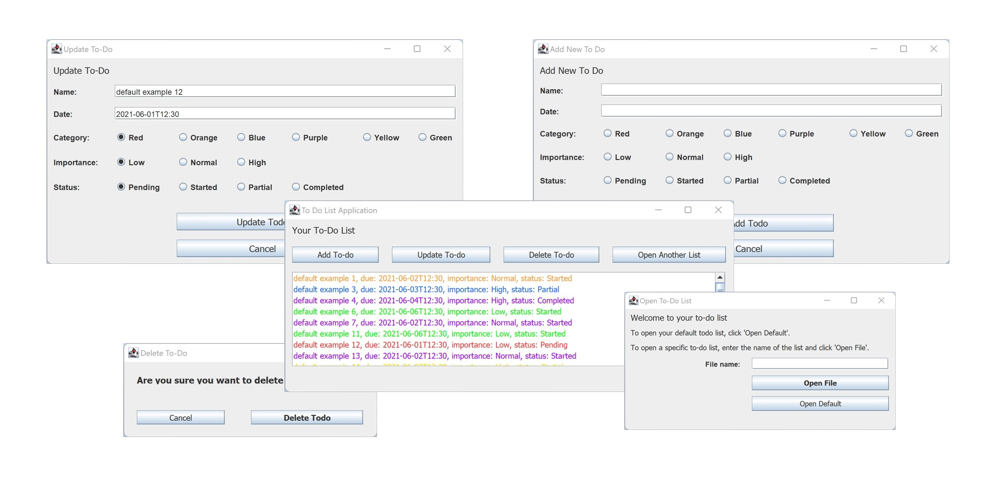

# To-Do List GUI

## Project description
This project consists of a to-do list program made using Java GUIs. This implementation supports file saving and a loading mechanism that allows the users to keep several different lists. This mechanism uses txt files to store all of the data.

ddd

## How to install the project
Download a zip file of the project from the code menu above. The downloaded folder needs to be unzipped and all files need to be uploaded to an IDE, such as IntelliJ.

## How to use the project
You can run this project through an IDE that supports Java. Once uploaded, the program can be used by running the file CLIMenu.java. This is the **only** file that needs to be run for this project to work correctly.

## To run all tests: 
from the main menu, select Run | Run ‘All in test’ with coverage. This would run all the unit tests in the module with coverage. 

Note - If you don’t see the test coverage in IntelliJ, then please follow these settings to see the coverage. 

-Open Edit Configurations menu 

-Click on Modify Options > Collect coverage in test folders 

## File breakdown
Multiple files consist of GUIs:
+ AddGUI.java
+ DeleteGUI.java
+ ImportGUI.java
+ TodoGUI.java
+ UpdateGUI.java

There are additionally made class files:
+ Todo.java
+ Category.java
+ Importance.java
+ Status.java

All of these files are brought together by the CLIMenu.java file.
